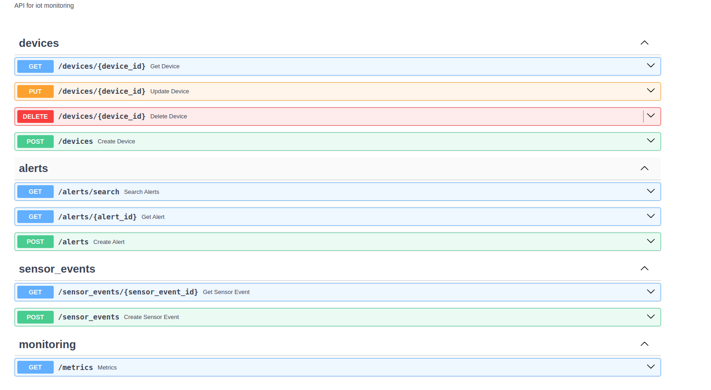

IoT Events Monitoring
---------------------
Проект моделирует систему мониторинга событий IoT-устройств, обработки этих событий, генерации алертов и предоставляет REST API для управления устройствами и алертами.

Features
--------
- 📦 Разделение на слои: domain, application, infrastructure, presentation
- 🔌 Инъекция зависимостей через DI-контейнер
- 📡 Обработка событий через Kafka
- 🗃 Хранение данных в MongoDB
- 🔍 Поиск через Elasticsearch
- 📊 Мониторинг с помощью Prometheus и Grafana
- 🧪 Тестирование: юнит, интеграционные и функциональные тесты
- 🐳 Docker: dev и test окружения
- 🛠 Использование uv для быстрой работы с зависимостями

## Стек

| Category               | Technologies                          |
|------------------------|---------------------------------------|
| **Language**           | Python 3.12.1                         |
| **Web Framework**      | FastAPI                               |
| **Database**           | MongoDB, Elasticsearch                |
| **Search Engine**      | Elasticsearch                         |
| **Message Queue**      | Kafka                                 |
| **DI**                 | dishka                                |
| **Infrastructure**     | Docker, Docker Compose                |
| **Logging**            | Filebeat → Elasticsearch → Kibana     |
| **Monitoring**         | Prometheus, Grafana                   |
| **Testing**            | Pytest: unit, functional, integration |
| **Build Tool**         | uv                                    |
| **Linting/Formatting** | Ruff                          |


Структура проекта
----------------
```tree
 src
│   ├── application
│   │   ├── __init__.py
│   │   └── use_cases
│   ├── consumer
│   │   ├── __init__.py
│   │   └── kafka 
│   ├── core
│   │   ├── clients
│   │   ├── config.py
│   │   ├── exceptions.py
│   │   ├── __init__.py
│   │   ├── logging_config.py
│   │   └── message_consumer.py
│   ├── domain
│   │   ├── alerts
│   │   ├── devices
│   │   ├── enums.py
│   │   ├── __init__.py
│   │   └── sensor_events
│   ├── infrastructure
│   │   ├── di
│   │   ├── elastic
│   │   ├── __init__.py
│   │   ├── messaging
│   │   └── mongodb
│   ├── __init__.py
│   ├── monitoring
│   │   ├── __init__.py
│   │   ├── metrics.py
│   │   └── middleware.py
│   ├── presentation
│   │   ├── api
│   │   └── __init__.py
├── tests
│   ├── functional
│   │   ├── conftest.py
│   │   ├── devices
│   │   └── __init__.py
│   ├── __init__.py
│   ├── integration
│   │   ├── conftest.py
│   │   ├── devices
│   │   └──__init__.py 
│   ├── test_producer.py
│   └── unit
│       ├── devices
│       └── __init__.py    
```

Установка
---------------

- Перейдите в каталог созданного проекта.

    ``cd Iot_events_monitoring``


- Установка зависимостей сборки

    ``sudo apt-get install clang libpq-dev``


- Установка uv


    *On macOS or Linux*

    ``curl -LsSf https://astral.sh/uv/install.sh | sh``


    *On Windows*

    ``powershell -c "irm https://astral.sh/uv/install.ps1 | iex"``


- Установить проект

    ``uv python pin 3.12.1``

    ``uv venv``

    ``uv sync``

    ``source .venv/bin/activate``


- Команды форматирования кода

    ``ruff check --unsafe-fixes --fix``

    ``ruff format``


- Makefile команды

    ``make dev-up``  — запускает все сервисы (приложение, БД, Kafka и т.д.) в режиме разработки с помощью Docker Compose.

    ``make dev-down``  — останавливает и удаляет контейнеры dev-окружения.

    ``make test-up`` — запускает сервисы, необходимые для тестов (БД, Kafka и т.д.), в Docker Compose.

    ``make test-down`` — останавливает и удаляет контейнеры тестового окружения.

    ``make test-run`` — запускает все тесты с помощью pytest.

    ``make test-unit-run`` — запускает только unit-тесты.

    ``make test-integration-run`` — запускает только интеграционные тесты.

    ``make test-functional-run`` — запускает только функциональные тесты.


- Документация API будет доступна по адресу http://127.0.0.1:8000/docs после страта
    
